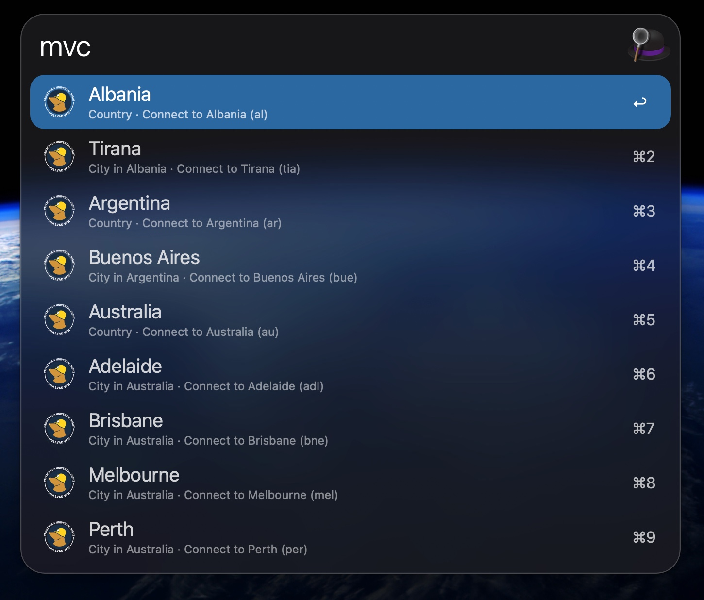

# Alfred - Mullvad Workflow

An Alfred workflow for controlling Mullvad VPN from your Alfred.

## Features

- Toggle VPN connection on/off
- Select a country or city to connect to
- Fast search through Mullvad's server locations

## Installation

Double-click `Mullvad.alfredworkflow` to install in Alfred

**Requirements**:
- Mullvad VPN CLI in your PATH

## Usage

- `mv`: Toggle connection
- `mvc <country/city>`: Search and connect to specific location
